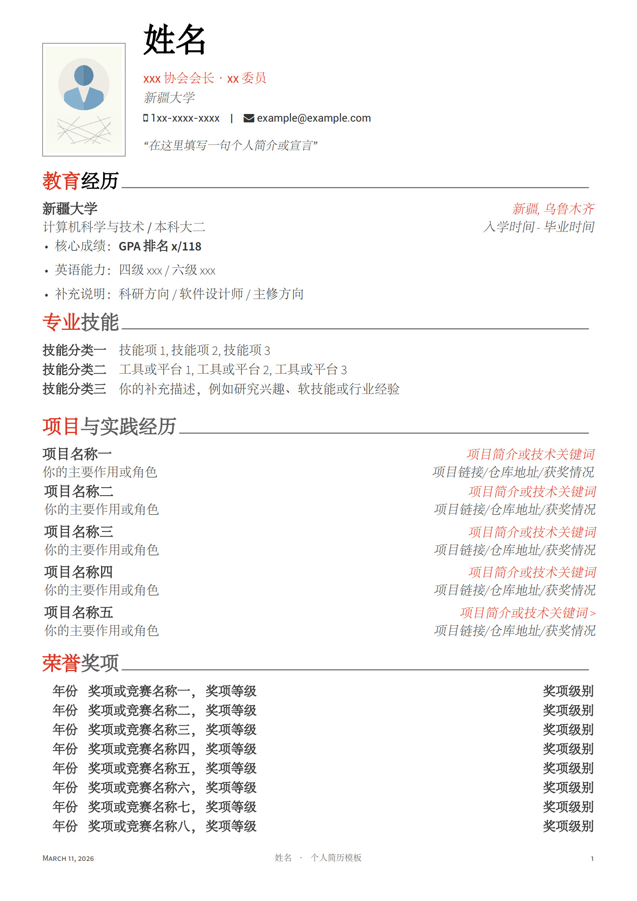
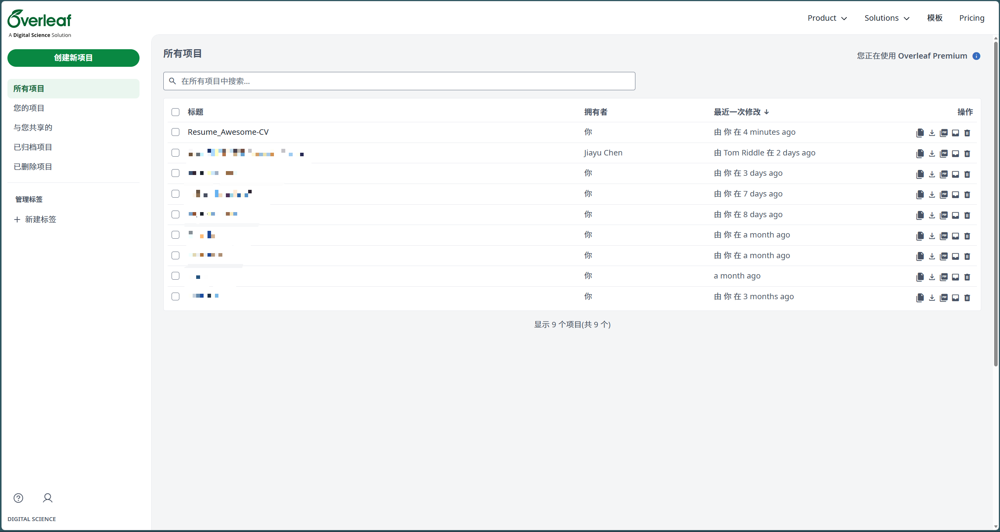
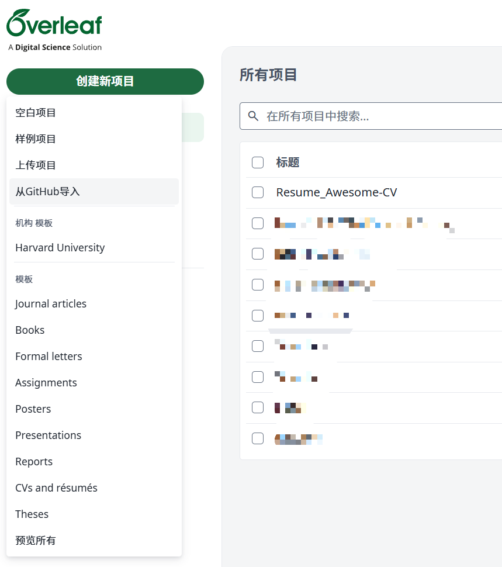
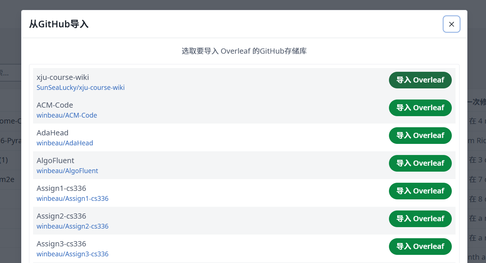
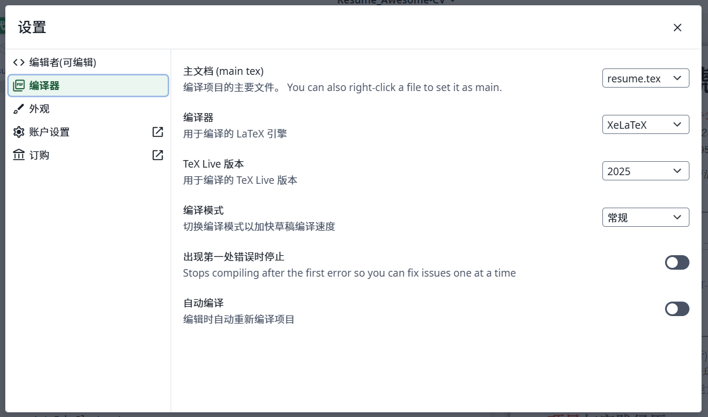

# Resume Awesome-CV 中文模板

这是一个基于 Awesome-CV 整理的中文简历模板，推荐使用方式是：

1. 先在 GitHub 上 `Fork` 本项目。
2. 再把你自己的 Fork 仓库导入 Overleaf。
3. 最后在 Overleaf 中直接修改内容并导出 PDF。

## 最终效果预览

下面这张图是本项目生成的简历最终效果预览：

## 1. 先 Fork 本项目

进入本仓库页面后，先点击右上角 `Fork`，把项目复制到你自己的 GitHub 账号下。

后续 Overleaf 导入时，选择你自己 Fork 出来的仓库，不要直接选原仓库。

## 2. 注册 Overleaf 账号

如果你还没有 Overleaf 账号，先注册一个：<https://cn.overleaf.com/project>

## 3. 在 Overleaf 上从 GitHub 导入项目

进入 Overleaf 后，选择从 GitHub 导入项目。

这里有两个常见注意点：

1. `从 GitHub 导入` 通常需要 Overleaf 会员。建议去闲鱼（赛博黑市）搜索 `Overleaf 会员` 获取。
2. 首次使用 GitHub 导入时，需要先在 Overleaf 上完成 GitHub 账号授权绑定。

## 4. 选择你刚 Fork 的 GitHub 仓库

在项目列表里选中你刚刚 Fork 的这个仓库。

导入完成后，Overleaf 会自动为你创建一个新项目。

## 5. 进入项目后，把编译器改为 XeLaTeX

进入 Overleaf 项目页面后，点击左下角 `Settings`，把编译器切换为 `XeLaTeX`。

这一步是必须的，因为本项目使用了中文字体配置，默认编译器可能无法正确生成 PDF。

## 项目结构说明

### 撰写本人简历

- `main.tex`
  - 这是主入口文件。
  - 这里主要填写个人信息，比如姓名、职位、学校、电话、邮箱、页脚文字、头像路径。

- `sections/education.tex`
  - 教育经历。

- `sections/skills.tex`
  - 专业技能 / 技术栈。

- `sections/projects.tex`
  - 项目与实践经历。

- `sections/honors.tex`
  - 荣誉奖项。

- `assets/profile.png`
  - 头像图片。
  - 你可以直接替换这张图片，也可以在 `main.tex` 里修改图片路径。

### 一般不用改的文件

- `styles/awesome-cv.cls`
  - 类文件入口。
  - 主要负责把样式模块组织起来。

- `styles/acv-core.tex`
  - 底层依赖、基础命令、字体与兼容逻辑。
  - 普通使用时不建议修改。

- `styles/acv-layout.tex`
  - 页眉页脚、章节结构、条目渲染等版式逻辑。
  - 如果你不确定影响，建议不要改。

- `styles/acv-theme-resume.tex`
  - 当前这份中文模板的主题样式。
  - 如果你想改字号、间距、颜色、页边距、标题样式，可以改这里。

- `docs/`
  - 存放 README 使用的教程截图。
  - 不参与简历编译。

## 建议修改顺序

1. 先改 `main.tex` 里的姓名、电话、邮箱、职位、学校、头像。
2. 再改 `sections/` 里的教育、技能、项目、奖项内容。
3. 如果只是改内容，到这里就够了。
4. 只有当你想改整体视觉风格时，再去改 `styles/acv-theme-resume.tex`。

## 编译结果不对时，建议优先检查

1. Overleaf 编译器是不是已经切到 `XeLaTeX`。
2. 头像路径是不是正确。
3. 修改内容时有没有破坏 LaTeX 的大括号、命令或环境结构。

如果你只是正常填写内容，通常只需要改 `main.tex` 和 `sections/` 下面的文件。  
不建议直接改底层样式文件，除非你明确知道自己在改什么。
